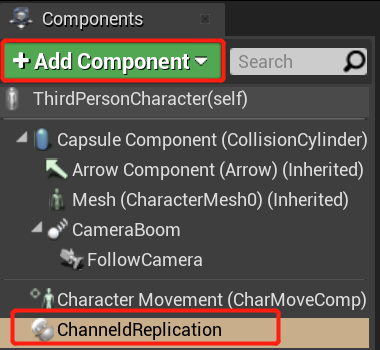
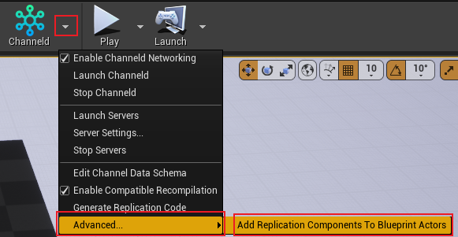
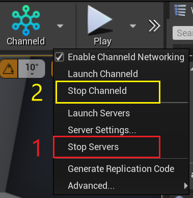

# 推荐工作流

## 本地开发迭代

### 使用UE原生网络同步开发
开发过程推荐优先使用[UE原生网络同步](https://docs.unrealengine.com/4.27/zh-CN/InteractiveExperiences/Networking/Actors/)进行GamePlay的开发和调试。在实现GamePlay功能后再开启ChanneldUE网络同步进行开发和调试。这样可以避免频繁地生成同步代码、启动专用服务器和网关。
>使用UE原生网络同步时请确保已关闭ChanneldUE的网络同步：
>
>

### 使用ChanneldUE网络同步进行测试
当实现了GamePlay功能并测试完成后，就可以使用ChanneldUE的网络同步来进行测试。
#### 开启ChanneldUE网络同步
开启ChanneldUE网络同步，使UE原生的网络同步切换到ChanneldUE网络同步：


#### 为Actor开启同步功能
在UE原生网络同步配置的基础上还需要为Actor添加同步组件。ChannelUE支持为C++和蓝图Actor添加同步组件。具体操作如下：
* 为C++ Actor添加同步组件
    1. Actor 类中声明`ChanneldReplicationComponent`组件
    ```
    #include "Replication/ChanneldReplicationComponent.h"
    ...
    class XXX_API ACppActor : public AActor
    {
        GENERATED_BODY()
    protected:
        UPROPERTY()
        UChanneldReplicationComponent* ChanneldReplicationComponent;
        ...
    };
    ```

    2. Actor 的构造函数中实例化`ChanneldReplicationComponent`组件
    ```
    ACppActor::ACppActor()
    {
        ChanneldReplicationComponent = CreateDefaultSubobject<UChanneldReplicationComponent>(TEXT("ChanneldReplication"));
    }
    ```

* 为蓝图Actor中添加同步组件
    

##### 为已有项目的同步Actor添加同步组件
除手动为同步Actor添加同步组件外，ChanneldUE提供了工具为已有项目中的Actor添加同步组件：



>注意：该工具会加载项目中所有的Actor，如果项目中有大量的Actor，可能会导致加载时间过长，建议在仅在项目中途才使用ChanneldUE插件时使用一次该功能或者较小项目中使用该功能。

#### 配置频道数据模型
为同步Actor添加同步组件后还不足以使他们通过ChanneldUE同步，还需指定同步Actor的状态在哪个频道中同步。ChanneldUE通过频道数据模型来指定同步Actor的状态在哪个频道中同步。
>频道数据模型详细说明和使用可参考[频道数据模型](./channel-data-schema.md)

##### 打开频道数据模型编辑器

频道数据模型需要在频道数据模型编辑器中进行配置。点击ChannelUE插件的`Editor Channel Data Schema` 按钮：


将会打开如下编辑器窗口：


##### 将Actor状态添加到频道数据模型
首先，需要更新同步Actor缓存。在频道数据编辑器上方点击`Refresh...`按钮：


等待同步Actor缓存更新完成后，就可以将新增的同步Actor状态添加到某一个频道数据下：


##### GameState
通常GameState在服务器中只有唯一的实例，因此可以将GameState的状态设置为单例：


>在多服情况下建议将GameState的状态放到Global频道中并设置为单例，以保证GameState的状态在所有的服务器中保持一致。
>除了GameState外，如WorldSettings等都是单例，同样建议将其状态设置为单例。

#### 生成同步代码
配置完成频道数据模型后，需要生成C++的同步代码。同步代码主要是用来处理频道数据模型的状态同步的。

##### 生成
在频道数据编辑器上方点击`Generate...`按钮即可生成同步代码：


##### 热编译兼容模式
ChannelUE提供了热编译兼容模式，该模式下每次生成同步代码后自动热编译项目源码，如果关闭热编译兼容模式则在生成同步代码后需要先关闭UE编辑器再通过源码编译。


>热编译兼容模式下每次生成的同步代码都会存在差异，所以在发布前建议关闭热编译兼容模式再生成一次同步代码。

### 本地测试
由于ChanneldUE采用了分布式专用服务器的架构，所以在本地测试时需要启动多个专用服务器和网关。ChannelUE提供了专用服务器和网关的启动工具。

#### 启动专用服务器和网关
通过插件的二级菜单开启专用服务器和网关，步骤如下：


<!-- ，但是请先确保`Launch Channeld`成功开启网关后再通过`Launch Servers`开启专用服务器。 -->
1. 确保开启了ChanneldUE的同步功能
2. 点击`Launch Channeld`开启channel网关

    channeld网关开启成功会有如下输出：
    

3. 点击`Launch Servers`开启专用服务器

#### 测试多个客户端
如果要同时开启多个客户端，需要对默认的编辑器设置做一些修改。打开主菜单`编辑 -> 编辑器偏好设置 -> 关卡编辑器 -> 播放`，在`Multiplayer options`中，**取消**`单进程下的运行`的勾选：


#### 关闭专用服务器和网关
测试完成后，可以通过插件的二级菜单关闭专用服务器和网关，依次点击`Stop Servers`和`Stop Channeld`即可关闭专用服务器和网关。



## 协作和版本控制

### 频道数据模型
#### 频道数据模型定义文件
频道数据模型定义文件建议通过版本控制工具进行版本控制，以保证多人协作时频道数据模型的一致性。频道数据模型定义文件路径为`Config/ChanneldChannelDataSchema.json`。

#### 配置频道数据模型
如果在配置频道数据模型之前通过版本控制变更了项目代码，那么请先[更新一次同步Actor缓存](#新增Actor)以确保频道数据状态能正确的显示在频道数据编辑器中。

### 同步代码

#### 重新生成一次同步代码
如果通过版本控制变更了项目代码，建议执行如下操作：
1. 先手动删除位于`Source/<游戏模块>/ChanneldGenerated`目录下的文件，确保能够顺利编译
2. [生成一次同步代码](#生成同步代码)
>如使用git作为版本控制工具，可以在项目根目录下的`.git/hooks/post-merge`脚本中添加删除`Source/<游戏模块>/ChanneldGenerated`目录的逻辑。

#### 无需上传至版本控制
推荐将ChanneldUE生成的同步代码忽略，以免版本控制工具将其纳入版本控制中。
>如使用git作为版本控制工具，可以在项目根目录下的`.gitignore`文件中添加如下内容：
>```
># ChanneldUE生成的同步代码
>/Source/**/ChanneldGenerated
>```